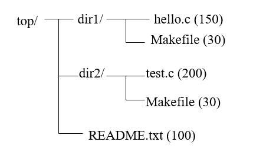
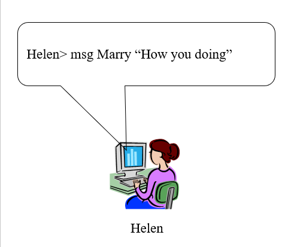
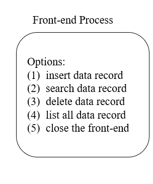
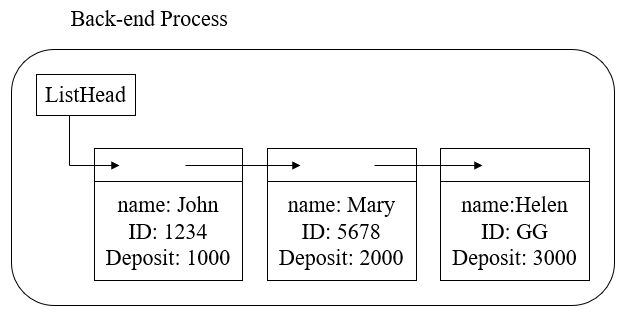

<!---
<link href="style.css" rel="stylesheet"></link>
-->
# Unix programming

## Prerequisites

### Linux os
**Ex**:
```sh
- Ubuntu 16.04, 20.04.
- Fedora
- Debian
```

## Experiment Environment

- ```Fedora```/```Ubuntu```/```Red Hat Enterprise```/```CentOS```
	- The CSIE server: ```Ubuntu```
	- My laptop: ```Ubuntu 16.04```
	
- With GNU tool-chain
	- ```gcc``` (the C compiler)
	- ```gdb``` (the GNU debugger)


## Why learning UNIX?

- Academic research
	- Lots of open-source free software
	- Innovative software appears on ```UNIX``` first
	- Network computing research (cluster/grid)
	- Embedded system and SoC (system-on-chip)
	- Most of embedded software are Linux-based
	```diff
	- MOST IMPORTANT: 
	```
	&nbsp;&nbsp;&nbsp;&nbsp;Make me more familiar on playing computer!


## Topics Covered

- ```UNIX``` architecture
- File System Operations
- Terminal I/O
- Concurrent Programming
- process/thread, signals, semaphores, IPC, etc.
- Network Computing
- Socket, RPC

## Prerequisites 

- Setup my Linux environment 
	- Use the embedded system LAB (dual-boot w/ Fedora)
	- Use my own computer
		- Most of Linux distribution (e.g. ```Fedora 9+```) supports dual-boot
		- I can still have my M$-Windows with Linux

- Test the following software works
	- Shells: ```bash```, ```tcsh```, etc
	- Programming tools: ```gcc```, ```gdb```, ```make```
	- My favorite X-window: ```KDE```/```Gnome```
	- My favorite GUI debugger (```ddd```, ```kdbg```, etc.)
	- My favorite text editor (```kwrite```, ```emacs```, ```vi```, etc.)

## First UNIX instruction I should learn

- man
	- ```man command``` to look for how to use certain command
		- Example: ```man gcc```
- info
	- Example: ```info gcc``` for detailed manual of gcc compiler

## Projects introduction

1. Write the first program:
	- Write the Makefile to build the executable program in sub-folder ```hw_01```.
		- Three functions spread across multiple files: main, calculate, mult.
		- There is no source code for function mult, only the compiled object code in ```lib_mult.a```.
		- The correct execution result is ***X=610***.
		
	- The executable program I build should:
		- Correctly execute, and
		- Be able to run in a debugger
	
2. Define my own fstream class.
	- Build a standard ```C++``` class using system calls.
	- Write a class named ```myfstream```.
		- Similar functionality to the standard ```C++``` class fstream.
		- Contains at least these methods:	
			- Open
			- Close
			- Read
			- Write
			- Operator <<
			- Operator >>
	- Requirements to my program(Learn how ```C/C++``` standard libraries are built):
		- Build the library and deliver to other users.
			- Separate ```.h``` file.
			- Build the library file ```libmyfstream.a```.
		- Test my program by other users.
			- Deliver only ```.h``` and ```.a``` files.
			- ```C++``` source code on methods implementation should not be delivered to the test users.
		- I am not allowed to use any ```C/C++``` standard library functions/classes.
			- Only ```UNIX``` system calls are allowed.

3. Recursive into a directory tree and visit each file.
	- Program to:
		- Recursion into a directory tree and visit each file.
		- Print out file name and the number of lines in each file.  
			- Assume each file is a text file.<br /><br /><br />
	
				
4. On-line messenger.
	- Suppose I want to write such a program:  
		- List all my friends on-line.  
	
		- Send a message to one of my friends.
	- What do I need to know?
		- A simple messenger to send a string to other’s terminal.  
			
	
5. Database management program with auto recovery.<br /><br />
	- A database management program with auto recovery.
	- Back-end Process:
		- Always alive even the front-end is closed.
		- Store data in a linked list.
	- Auto-Recovery:
		- Automatic save data to disk:
			- ```Ctrl+c```


	  [](<div style="width:80px; height:100px">)
																				
																				[](</div>)
	


6. Matrix mulplication in parallel.		
	- Goal:
		- Guide me to write parallel program computing the dot-product.
		- With shared memory mechanism of ```UNIX```.
	- Write a dot-product with ```pthread```.\
	
	- I may modify from ```pthread_acc```.
	- Estimate the execution time and compare to sequential execution.

### Final project Introduction

- There are three projects that I could choose.
	1. Parallel sorting over 1M floating-point numbers
		- Sort 1M floating point numbers in non-descending order.
		- Execute on a 4-core PC.
		- Scored by the execution time, the smaller is better.
	2. File syncing to the cloud
		- Major Function: sync all files in a dedicated directory to a remote server.
			- Like ```dropbox```
			```diff
			- Not contributing much system workload
			```
		- Expected Result:
			- Automatic backup files (in a flat directory) to another directory.
		- Extra Function:
			- Automatic upload to a remote server.
			- Automatic sync the whole directory tree.

	3. Login shell
		- A shell program capable of execution a single command each time.
			- Basic functionality:
				- ```cd```, ```mkdir```, set environment variables.
				- Automatic path search.
			- Single machine.
            - Login shell through network.
        - Bonus:
			- Redirect outcome to files. 
			- Piped job execution. 
			- Execute background job. 
- I chose the first selection one as my final project: ***Matrix mulplication in parallel***.


	

